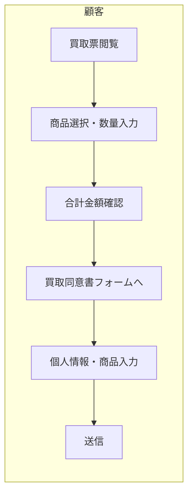

# 機能設計書

| 項目 | 内容 |
|------|------|
| 参照元 | ヒアリング内容まとめ.md、product-requirements.md、ubiquitous-language.md |
| 最終更新日 | 2026-03-04 |
| 版数 | 1.0 |
| スコープ | MVP（顧客向けモックアップ） |

---

## 1. 顧客フロー図（MVP範囲）



MVPでは、買取票での選択情報を買取同意書フォームに引き継ぎ、二度手間が発生しないよう設計する。

---

## 2. MVP機能一覧

| No. | 機能名 | 種別 | 説明 |
|-----|--------|------|------|
| 1 | 買取票 | Webページ | 商品一覧表示、選択、合計計算 |
| 2 | 買取同意書フォーム | Webフォーム | 個人情報・商品入力、送信（モック） |
| 3 | 画像生成プレビュー | プレビュー機能 | 3パターンのレイアウト表示 |
| 4 | 管理者画面 | 管理UI | カテゴリ・商品のCRUD |

---

## 3. 各機能の詳細設計

### 3.1 買取票

#### 3.1.1 画面構成

| 要素 | 仕様 |
|------|------|
| ヘッダー | 「買取専門店WOW」ロゴ |
| カテゴリタブ/フィルター | ポケモン未開封 / ワンピース未開封 / AR最低保証 等 |
| 商品一覧 | 商品画像 + 商品名 + 買取価格 + チェックボックス + 数量入力 |
| 合計表示 | 選択した商品の合計買取金額をリアルタイム表示 |
| CTA | 「買取同意書へ進む」ボタン（選択商品をフォームに引き継ぐ） |

#### 3.1.2 機能仕様

| 項目 | 仕様 |
|------|------|
| 商品選択 | チェックボックスで複数選択可能 |
| 数量入力 | 各商品ごとに数値入力（1以上） |
| 合計計算 | 選択商品 × 数量 × 買取価格 の合計を自動計算 |
| データ連携 | 選択商品・数量を買取同意書フォームに引き継ぐ（URLパラメータ or セッション） |

#### 3.1.3 ワイヤーフレーム（概要）

```
+----------------------------------+
| [買取専門店WOW ロゴ]              |
+----------------------------------+
| [ポケモン] [ワンピース] [AR保証]  |
+----------------------------------+
| [img] 商品A  1,000円  [ ] 数量[_]|
| [img] 商品B  2,500円  [ ] 数量[_]|
| [img] 商品C    800円  [ ] 数量[_]|
| ...                              |
+----------------------------------+
| 合計: 〇〇〇〇円                 |
| [買取同意書へ進む]               |
+----------------------------------+
```

---

### 3.2 買取同意書フォーム

#### 3.2.1 入力項目（全14項目・必須）

| No. | 項目名 | 入力形式 | 備考 |
|-----|--------|----------|------|
| 1 | 氏名 | テキスト | |
| 2 | 氏名（読み仮名） | テキスト | |
| 3 | 性別 | 選択（男/女/その他） | |
| 4 | 職業 | テキスト | |
| 5 | 生年月日 | 日付 | |
| 6 | 電話番号 | テキスト | |
| 7 | メールアドレス | テキスト | |
| 8 | 住所 | テキスト（複数行可） | |
| 9 | 銀行口座情報 | テキスト | 銀行名・支店名・口座番号等 |
| 10 | 適格請求書発行事業者の該否 | 選択（はい/いいえ） | |
| 11 | Xアカウント名 | テキスト | 取引追跡用 |
| 12 | 顔写真付き身分証明書 | ファイル選択 | JPEG/PNG/PDF（モックでは選択のみ、実保存なし） |
| 13 | 売りたい商品 | 複数選択 | 買取票の商品一覧と連動（買取票から引き継ぎ） |
| 14 | 各商品の数量 | 数値 | 商品ごとに入力（買取票から引き継ぎ） |

#### 3.2.2 注意書き・免責事項（表示する文言）

- 「最終的な買取金額は、当方での査定結果を確認後、正式にお伝えいたします」
- 古物商に基づく個人情報の取り扱いに関する説明
- 小物商取引に必要な法的注意事項

#### 3.2.3 送信後の処理（MVP）

- 送信ボタン押下で「送信完了」のモーダル/トーストを表示
- 実データ送信・スプレッドシート連携はスコープ外
- 合計見積金額を自動計算して表示（買取票から引き継いだ商品・数量に基づく）

#### 3.2.4 ワイヤーフレーム（概要）

```
+----------------------------------+
| 買取同意書                       |
+----------------------------------+
| 氏名          [______________]  |
| 氏名（読み）  [______________]  |
| 性別          ( )男 ( )女 ( )その他|
| ...                              |
| 売りたい商品  [買取票から表示]   |
| 各商品の数量  [買取票から表示]   |
| 合計見積: 〇〇〇〇円            |
+----------------------------------+
| [注意書き・免責事項]             |
| [同意して送信]                   |
+----------------------------------+
```

---

### 3.3 画像生成プレビュー

#### 3.3.1 3パターンのレイアウト仕様

| パターン | 名称 | 仕様 |
|----------|------|------|
| A | 単品表示 | 1商品を大きく表示（商品画像 + 商品名 + 買取価格） |
| B | 複数表示 | 2〜10商品を並べて1枚の画像に合成 |
| C | 一覧表示 | 数十商品を一覧形式で表示 |

#### 3.3.2 共通仕様

- 画像内に「買取専門店WOW」ロゴを配置
- X投稿の画角・解像度に最適化（見切れ防止）
- 参考デザイン：カードショップの買取票投稿を参考

#### 3.3.3 MVPでの実装範囲

- 選択した商品から3パターンのプレビュー画像を画面に表示
- 実際のX投稿・API連携はスコープ外

---

### 3.4 管理者画面

#### 3.4.1 カテゴリ管理

| 操作 | 仕様 |
|------|------|
| 一覧 | カテゴリ名の一覧表示 |
| 追加 | カテゴリ名を入力して追加 |
| 編集 | カテゴリ名を変更 |
| 削除 | カテゴリを削除（紐づく商品がある場合は警告） |

#### 3.4.2 商品管理

| 操作 | 仕様 |
|------|------|
| 一覧 | 商品画像・商品名・買取価格・カテゴリの一覧表示 |
| 追加 | 商品名・買取価格・カテゴリ・画像URLを入力して追加 |
| 編集 | 各項目を変更 |
| 削除 | 商品を削除 |

#### 3.4.3 データ

- MVPではモックデータ（JSON/ローカルストレージ）で動作
- 永続化・API連携はスコープ外

---

## 4. データフロー（概念レベル）

```
[買取票] 商品選択・数量
    ↓ （URLパラメータ or セッション）
[買取同意書フォーム] 個人情報 + 商品・数量（引き継ぎ）
    ↓ （モック送信）
[送信完了表示]
```

実連携（スプレッドシート、ストレージ等）は将来フェーズで対応。

---

## 5. UX上の注意点

- 買取票での試算情報と買取同意書フォームの入力で二度手間が発生しないよう、選択情報を自動引き継ぐ
- 顧客の導線を一本化し、離脱率を最小化
- コンバージョン率を意識したCTA（行動喚起）設計
- スマートフォン優先のレスポンシブデザイン

---

## 改訂履歴

| 版数 | 日付 | 変更内容 |
|------|------|----------|
| 1.0 | 2026-03-04 | 初版作成（MVPスコープ） |
