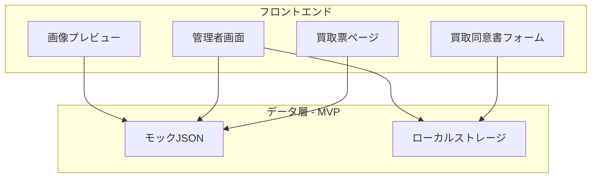

# 技術仕様書

| 項目 | 内容 |
|------|------|
| 参照元 | ヒアリング内容まとめ.md、functional-design.md |
| 最終更新日 | 2026-03-04 |
| 版数 | 1.0 |
| スコープ | MVP（顧客向けモックアップ） |

---

## 1. 技術スタック選定

### 1.1 モックアップに必要な最小限

| レイヤー | 技術 | 備考 |
|----------|------|------|
| フロントエンド | React / Next.js または Vue / Nuxt | SPA/SSR いずれも可。選定は開発者判断 |
| スタイリング | Tailwind CSS または CSS Modules | レスポンシブ対応を容易にする |
| データ | モックデータ（JSON） | ローカルストレージ or 静的JSONファイル |
| 画像生成 | Canvas API または html2canvas | プレビュー表示用 |
| ビルド | Vite または Next.js 標準 | 開発効率を優先 |

### 1.2 外部API（MVPでは未連携）

| サービス | 用途 | 対応フェーズ |
|----------|------|-------------|
| X（Twitter）API | 投稿自動化、DM自動返信 | 将来 |
| LINE公式アカウントAPI | 自動返信、リッチメニュー、通知 | 将来 |
| Googleスプレッドシート API | データ自動転記 | 将来 |

---

## 2. モックアップアーキテクチャ図



MVPではバックエンド・APIサーバーは不要。フロントエンドとモックデータのみで動作。

---

## 3. モックデータ構造

### 3.1 カテゴリ

```typescript
interface Category {
  id: string;
  name: string;
  sortOrder?: number;
}
```

### 3.2 商品

```typescript
interface Product {
  id: string;
  name: string;
  buybackPrice: number;  // 買取価格（円）
  imageUrl: string;
  categoryId: string;
}
```

### 3.3 買取票での選択状態

```typescript
interface SelectedItem {
  productId: string;
  quantity: number;
}
```

### 3.4 買取同意書フォーム入力

```typescript
interface ConsentFormInput {
  // 個人情報
  name: string;
  nameKana: string;
  gender: 'male' | 'female' | 'other';
  occupation: string;
  birthDate: string;
  phone: string;
  email: string;
  address: string;
  bankAccount: string;
  invoiceEligible: boolean;
  xAccountName: string;
  idDocument?: File;  // モックでは未使用
  
  // 商品（買取票から引き継ぎ）
  selectedItems: SelectedItem[];
}
```

---

## 4. 画像生成の技術方針

### 4.1 実装方法

| 方式 | 説明 | 推奨 |
|------|------|------|
| Canvas API | 2D描画で画像を生成 | ○ 軽量 |
| html2canvas | DOMを画像化 | △ 複雑なレイアウト向け |
| SVG + データURL | SVGを画像として出力 | ○ ベクター品質 |

### 4.2 出力仕様

| 項目 | 仕様 |
|------|------|
| アスペクト比 | X投稿に最適（16:9 または 1:1） |
| 解像度 | 1200px 幅程度（見切れ防止） |
| ロゴ配置 | 全パターン共通で「買取専門店WOW」ロゴを配置 |

### 4.3 3パターンのレイアウト

- **単品表示**: 1商品、中央配置、大サイズ
- **複数表示**: 2〜10商品、グリッド配置
- **一覧表示**: 多数商品、テーブル形式

---

## 5. ディレクトリ構成（概要）

```
src/
├── buyback-ticket/    # 買取票
├── consent-form/     # 買取同意書
├── admin/             # 管理者画面
├── image-preview/     # 画像プレビュー
├── shared/            # 共通コンポーネント・型・モックデータ
└── ...
```

詳細は [repository-structure.md](repository-structure.md) を参照。

---

## 6. セキュリティ（モックアップ段階）

| 項目 | 方針 |
|------|------|
| HTTPS | 本番デプロイ時はHTTPSを使用 |
| 個人情報 | モックでは実データを永続化しない |
| 身分証 | ファイル選択のみ、実アップロード・保存は行わない |

---

## 7. 非機能要件

| 要件 | 目標値 |
|------|--------|
| 買取票ページ表示 | 3秒以内 |
| 画像プレビュー生成 | 10秒以内 |
| レスポンシブ | スマートフォン（375px幅）で表示・操作可能 |
| 対応ブラウザ | Chrome, Safari, Firefox 最新版 |

---

## 8. 将来拡張時の技術方針

| 機能 | 技術 |
|------|------|
| データ永続化 | Googleスプレッドシート API または Supabase/Firebase |
| 身分証保存 | クラウドストレージ（S3, GCS等） |
| X/LINE連携 | 各公式API |

---

## 改訂履歴

| 版数 | 日付 | 変更内容 |
|------|------|----------|
| 1.0 | 2026-03-04 | 初版作成（MVPスコープ） |
